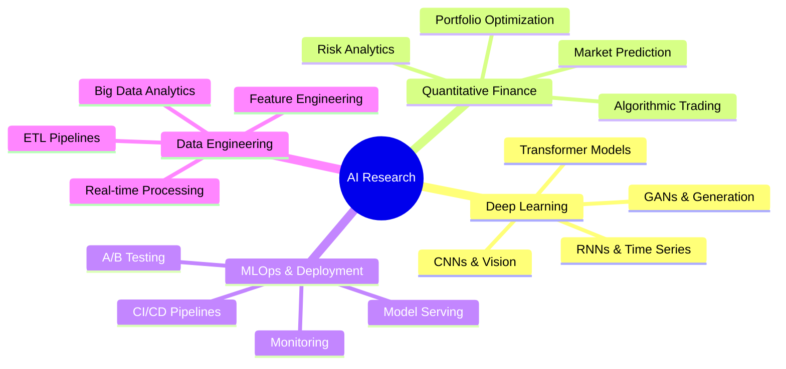
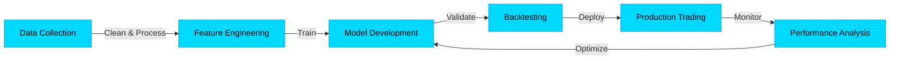

# 🧬 Youssef Bechara | Architecting Intelligence

<div align="center">

```ascii
╔══════════════════════════════════════════════════════════════════════════╗
║                                                                          ║
║   █████╗ ██╗    ██████╗ ███████╗██╗   ██╗███████╗██╗      ██████╗ ██████╗ ███████╗██████╗ 
║  ██╔══██╗██║    ██╔══██╗██╔════╝██║   ██║██╔════╝██║     ██╔═══██╗██╔══██╗██╔════╝██╔══██╗
║  ███████║██║    ██║  ██║█████╗  ██║   ██║█████╗  ██║     ██║   ██║██████╔╝█████╗  ██████╔╝
║  ██╔══██║██║    ██║  ██║██╔══╝  ╚██╗ ██╔╝██╔══╝  ██║     ██║   ██║██╔═══╝ ██╔══╝  ██╔══██╗
║  ██║  ██║██║    ██████╔╝███████╗ ╚████╔╝ ███████╗███████╗╚██████╔╝██║     ███████╗██║  ██║
║  ╚═╝  ╚═╝╚═╝    ╚═════╝ ╚══════╝  ╚═══╝  ╚══════╝╚══════╝ ╚═════╝ ╚═╝     ╚══════╝╚═╝  ╚═╝
║                                                                          ║
╚══════════════════════════════════════════════════════════════════════════╝
```


</div>

---

## 📡 System Status & Metrics Dashboard

<div align="center">

```python
class AIEngineer:
    def __init__(self):
        self.name = "Youssef Bechara"
        self.role = "AI/ML Engineer & Quantitative Developer"
        self.location = "Building the Future 🌍"
        self.knowledge_domains = [
            "Deep Learning", "Algorithmic Trading", 
            "Computer Vision", "NLP", "Quantitative Finance"
        ]
        
    def daily_routine(self):
        return {
            "coffee": "☕" * 5,
            "code": ["Python", "MQL5", "SQL"],
            "research": ["arXiv", "Papers", "Market Data"],
            "build": ["Neural Networks", "Trading Bots", "ML Pipelines"]
        }
    
    def current_focus(self):
        return """
        🎯 Developing next-gen trading algorithms
        🧬 Fine-tuning transformer architectures
        📊 Building real-time ML inference systems
        🚀 Exploring reinforcement learning in finance
        """
```

<table>
<tr>
<td width="50%">

```yaml
AI Engineer Specs:
━━━━━━━━━━━━━━━━━━━━━━━━━━
├─ 🧠 Neural Networks: ████████████ 95%
├─ 📊 Data Science:    ███████████░ 92%
├─ 💹 QuantFinance:    ██████████░░ 88%
├─ ⚡ MLOps:           █████████░░░ 85%
├─ 🎯 Deep Learning:   ████████████ 96%
└─ 🔬 Research:        ██████████░░ 90%

Status: 🟢 Available for collaboration
Current Project: Reinforcement Learning Trading Bot
Learning: Transformer Architectures & Attention
```

</td>
<td width="50%">

```yaml
Tech Stack Proficiency:
━━━━━━━━━━━━━━━━━━━━━━━━━━
ML/AI:
  ├─ TensorFlow/Keras  ▓▓▓▓▓▓▓▓▓▓ Expert
  ├─ PyTorch           ▓▓▓▓▓▓▓▓▓░ Advanced
  ├─ Scikit-learn      ▓▓▓▓▓▓▓▓▓▓ Expert
  └─ OpenCV            ▓▓▓▓▓▓▓▓░░ Advanced

Trading:
  ├─ MQL5              ▓▓▓▓▓▓▓▓▓▓ Expert
  ├─ Backtesting       ▓▓▓▓▓▓▓▓▓░ Advanced
  └─ Risk Management   ▓▓▓▓▓▓▓▓▓░ Advanced

Infrastructure:
  ├─ Docker            ▓▓▓▓▓▓▓▓░░ Advanced
  ├─ FastAPI           ▓▓▓▓▓▓▓▓▓░ Advanced
  └─ Apache Spark      ▓▓▓▓▓▓▓░░░ Intermediate
```

</td>
</tr>
</table>


</div>

---

## 🎯 Research Focus & Innovation Pipeline

<div align="center">



</div>

---

## 📊 Performance Analytics & GitHub Insights

<div align="center">

### 🔥 Contribution Heatmap & Statistics


<table>
<tr>
<td width="50%">

</td>
<td width="50%">

</td>
</tr>
</table>

### 📈 Language Distribution & Code Metrics

<table>
<tr>
<td width="50%">

</td>
<td width="50%">

```text
🐍 Python          ████████████████░░░░  80.2%
💎 MQL5            ███░░░░░░░░░░░░░░░░░  12.5%
🗄️ SQL             ██░░░░░░░░░░░░░░░░░░   5.1%
🔧 Shell           ░░░░░░░░░░░░░░░░░░░░   1.8%
📜 Other           ░░░░░░░░░░░░░░░░░░░░   0.4%
```

**Most Used Libraries:**
- `TensorFlow` • `PyTorch` • `Pandas` • `NumPy`
- `Scikit-learn` • `Matplotlib` • `Plotly`
- `FastAPI` • `Docker` • `Apache Spark`

</td>
</tr>
</table>

### 🏆 Achievement Showcase


### 📊 Detailed Analytics Dashboard


<table>
<tr>
<td></td>
<td></td>
</tr>
<tr>
<td></td>
<td></td>
</tr>
</table>


</div>

---

## 🛠️ Technology Stack & Arsenal

<div align="center">

### 🤖 Machine Learning & AI


### 📊 Data Science & Analytics


### 💹 Quantitative Finance & Trading


### ⚙️ MLOps & Infrastructure


### 🎨 Design & Visualization


</div>

---

## 🎓 Expertise Matrix & Research Areas

<div align="center">

<table>
<tr>
<td align="center" width="25%">

### 🧠 Deep Learning
```python
expertise = {
  "CNNs": "Advanced",
  "RNNs/LSTMs": "Expert",
  "Transformers": "Advanced",
  "GANs": "Intermediate",
  "Attention": "Advanced"
}
```
**Projects:** Image Classification, NLP Models, Time-Series Forecasting

</td>
<td align="center" width="25%">

### 📈 Algo Trading
```python
skills = {
  "MQL5": "Expert",
  "Backtesting": "Advanced",
  "Risk Mgmt": "Advanced",
  "HFT": "Intermediate",
  "Options": "Advanced"
}
```
**Focus:** EA Development, Strategy Optimization, Market Microstructure

</td>
<td align="center" width="25%">

### 🔬 Data Science
```python
toolbox = {
  "Analysis": "Expert",
  "Visualization": "Advanced",
  "Feature Eng": "Expert",
  "A/B Testing": "Advanced",
  "Pipelines": "Advanced"
}
```
**Domains:** Predictive Analytics, Statistical Modeling, ETL

</td>
<td align="center" width="25%">

### ⚡ MLOps
```python
stack = {
  "Docker": "Advanced",
  "APIs": "Expert",
  "Monitoring": "Advanced",
  "CI/CD": "Intermediate",
  "Serving": "Advanced"
}
```
**Experience:** Model Deployment, Scalable Systems, Real-time ML

</td>
</tr>
</table>

</div>

---

## 🚀 Featured Projects & Research

<div align="center">



### 🎯 Current Research Focus

| Area | Description | Status |
|------|-------------|--------|
| 🤖 **RL Trading Bot** | Developing reinforcement learning algorithms for adaptive trading strategies | 🟡 In Progress |
| 🧬 **Transformer Fine-tuning** | Custom transformer architectures for financial time-series prediction | 🟢 Active |
| 📊 **Real-time ML Pipeline** | Building low-latency inference systems for high-frequency trading | 🟡 In Progress |
| 🔍 **Market Sentiment Analysis** | NLP models for social media and news sentiment extraction | 🟢 Active |
| 💹 **Portfolio Optimization** | ML-driven portfolio construction and risk management | 🔵 Planning |

</div>

---

## 📚 Knowledge Base & Learning

<div align="center">

```text
📖 Reading List (2024):
├─ "Deep Learning" - Goodfellow, Bengio, Courville
├─ "Advances in Financial Machine Learning" - Marcos López de Prado
├─ "Machine Learning for Algorithmic Trading" - Stefan Jansen
├─ "Probabilistic Machine Learning" - Kevin Murphy
└─ "Designing Data-Intensive Applications" - Martin Kleppmann

🎓 Recent Certifications & Courses:
├─ Deep Learning Specialization (deeplearning.ai)
├─ Advanced Machine Learning with TensorFlow on GCP
├─ Algorithmic Trading & Quantitative Analysis
└─ MLOps: Production ML Systems

📝 Publications & Articles:
├─ "Real-time Market Prediction using LSTMs"
├─ "Optimizing Trading Strategies with Reinforcement Learning"
└─ "Feature Engineering for Financial Time Series"
```

</div>

---

## 🌐 Connect & Collaborate

<div align="center">

### Let's Build Something Amazing Together! 🚀

<table>
<tr>
<td align="center">

[](https://sites.google.com/view/scitrade/)

</td>
<td align="center">

[](mailto:youssefbechara.ap@gmail.com)

</td>
<td align="center">

[](https://kaggle.com/youssefbechara)

</td>
</tr>
<tr>
<td align="center">

[](https://www.youtube.com/c/youssefbechara8809)

</td>
<td align="center">

[](https://instagram.com/youssef_.bechara)

</td>
<td align="center">

[](https://discord.gg/youssefbechara)

</td>
</tr>
</table>


### 💡 Open to:
```yaml
Collaboration: [Research Projects, Open Source Contributions]
Consulting: [ML Strategy, Trading Systems, Data Architecture]
Speaking: [Tech Talks, Workshops, Conferences]
Mentoring: [AI/ML Students, Junior Developers]
```

</div>

---

## 💭 Philosophy & Approach

<div align="center">

```python
class ResearchPhilosophy:
    """
    My approach to AI and Quantitative Finance
    """
    def __init__(self):
        self.principles = {
            "data_driven": "Let the data speak, but always question it",
            "rigorous_testing": "Backtest religiously, deploy cautiously",
            "continuous_learning": "The field evolves daily, so must I",
            "open_collaboration": "Great ideas emerge from diverse minds",
            "ethical_ai": "Build systems that benefit humanity"
        }
    
    def workflow(self):
        return """
        1. 🔍 Research & Hypothesis Formation
        2. 📊 Data Collection & Exploratory Analysis
        3. 🧪 Experimentation & Model Development
        4. 📈 Rigorous Backtesting & Validation
        5. 🚀 Deployment & Continuous Monitoring
        6. 🔄 Iteration Based on Real-world Performance
        """
    
    def quote(self):
        return "At the intersection of mathematics, computer science, \
                and finance lies the future of intelligent markets."
```

> **"In God we trust, all others must bring data."** — W. Edwards Deming

> **"The best way to predict the future is to invent it."** — Alan Kay

</div>

---

## 📊 Visitor Analytics & Engagement

<div align="center">


### 🐍 Contribution Snake


</div>

---

<div align="center">


```text
╔═══════════════════════════════════════════════════════════════════════════╗
║                                                                           ║
║   "Transforming data into intelligence, algorithms into alpha,           ║
║    and ideas into reality — one model at a time."                        ║
║                                                                           ║
║   💡 Always Learning | 🚀 Forever Building | 🧠 Constantly Innovating    ║
║                                                                           ║
╚═══════════════════════════════════════════════════════════════════════════╝
```

**⭐ If you find my work interesting, consider starring some repositories!**

**💬 Open to collaborations, research discussions, and innovative projects**

</div>

---

<div align="center">
<sub>Last Updated: December 2024 | Built with 💙 and ☕ | Powered by AI & Data</sub>
</div>
