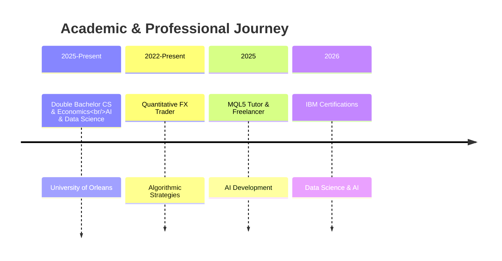

# Welcome to My Data-Driven World 👋

<div align="center">


## 🧬 **Data Alchemist • Quantitative Analyst • AI Engineer**

**Exploring the quantum intersection of Artificial Intelligence, Economics, and Financial Markets**

[](https://youssefbechara.github.io)
[](https://linkedin.com/in/youssefbechara)
[](https://github.com/YoussefBechara)
[](https://kaggle.com/youssefbechara)
[](https://twitter.com/@youssefbechara7)

</div>

## 📊 **Data Visualization Showcase**

```python
# Real-time Visualization Pipeline
import numpy as np
import plotly.graph_objects as go
from scipy import signal

def create_quant_chart():
    """
    Generates interactive quantitative visualization
    """
    x = np.linspace(0, 10, 1000)
    y1 = np.sin(x) * np.exp(-0.1*x)
    y2 = signal.sawtooth(2 * np.pi * 0.1 * x)
    
    fig = go.Figure()
    fig.add_trace(go.Scatter(
        x=x, y=y1, 
        mode='lines',
        name='Market Signal',
        line=dict(color='#00ffff', width=3)
    ))
    fig.add_trace(go.Scatter(
        x=x, y=y2,
        mode='lines',
        name='Seasonal Pattern',
        line=dict(color='#9d4edd', width=2, dash='dash')
    ))
    
    fig.update_layout(
        template='plotly_dark',
        paper_bgcolor='rgba(0,0,0,0)',
        plot_bgcolor='rgba(0,0,0,0)',
        font_color='#ffffff'
    )
    return fig
```

## 🎯 **Core Competencies Matrix**

| Domain | Proficiency | Key Technologies | Visualization Focus |
|--------|-------------|------------------|---------------------|
| **AI/ML** | ⭐⭐⭐⭐⭐ | `PyTorch` `TensorFlow` `scikit-learn` | Neural Network Architectures |
| **Quantitative Analysis** | ⭐⭐⭐⭐⭐ | `pandas` `numpy` `statsmodels` | Time Series Forecasting |
| **Data Engineering** | ⭐⭐⭐⭐ | `Apache Spark` `Kafka` `Airflow` | ETL Pipeline Monitoring |
| **Financial Markets** | ⭐⭐⭐⭐⭐ | `QuantLib` `backtrader` `TA-Lib` | Market Microstructure |
| **Economic Modeling** | ⭐⭐⭐⭐ | `PyMC3` `ARCH` `Prophet` | Macroeconomic Indicators |

<div align="center">

## 📈 **Technical Stack Visualization**


```mermaid
graph LR
    A[Data Collection] --> B[Preprocessing]
    B --> C[Feature Engineering]
    C --> D[Model Training]
    D --> E[Visualization]
    E --> F[Deployment]
    
    style A fill:#000000,stroke:#00ffff,stroke-width:3px
    style B fill:#000000,stroke:#00ffff,stroke-width:3px
    style C fill:#000000,stroke:#00ffff,stroke-width:3px
    style D fill:#000000,stroke:#00ffff,stroke-width:3px
    style E fill:#000000,stroke:#00ffff,stroke-width:3px
    style F fill:#000000,stroke:#00ffff,stroke-width:3px
```

</div>

## 🚀 **Featured Projects**

### **1. AI Sequential Trading Model** 
[](https://github.com/YoussefBechara)
[](https://github.com/YoussefBechara)

```python
# Multi-variable KNN Market Prediction
import torch
import torch.nn as nn

class SequentialTradingModel(nn.Module):
    """Proprietary AI trading model leveraging sequence mathematics"""
    def __init__(self, input_dim=50, hidden_dim=128):
        super().__init__()
        self.lstm = nn.LSTM(input_dim, hidden_dim, batch_first=True)
        self.attention = nn.MultiheadAttention(hidden_dim, num_heads=8)
        self.fc = nn.Sequential(
            nn.Linear(hidden_dim, 64),
            nn.LeakyReLU(),
            nn.Linear(64, 3)  # Buy/Hold/Sell
        )
```

### **2. Market Seasonal Analysis Platform**
[](https://github.com/YoussefBechara)
[](https://github.com/YoussefBechara)

```python
# Interactive Seasonality Visualization
import plotly.express as px
import plotly.graph_objects as go
from plotly.subplots import make_subplots

def create_seasonal_dashboard(data):
    fig = make_subplots(
        rows=3, cols=2,
        subplot_titles=('Yearly Pattern', 'Monthly Distribution', 
                       'Weekly Seasonality', 'Hourly Analysis',
                       'Statistical Breakdown', 'Forecast Projection'),
        specs=[[{'type': 'scatter'}, {'type': 'heatmap'}],
               [{'type': 'bar'}, {'type': 'box'}],
               [{'type': 'violin'}, {'type': 'scatter'}]]
    )
    
    # Add traces with cyan/purple color scheme
    for trace in fig.data:
        trace.update(line=dict(color='#00ffff'),
                     marker=dict(color='#9d4edd'))
    
    return fig
```

### **3. Economic News Sentiment Analyzer**
[](https://github.com/YoussefBechara)
[](https://github.com/YoussefBechara)

```python
# Real-time Sentiment Visualization
from transformers import pipeline
import matplotlib.pyplot as plt
import matplotlib.cm as cm

class EconomicSentimentVisualizer:
    def __init__(self):
        self.sentiment_analyzer = pipeline(
            "sentiment-analysis",
            model="finiteautomata/bertweet-base-sentiment-analysis"
        )
        
    def create_sentiment_heatmap(self, news_data):
        sentiments = []
        for article in news_data:
            result = self.sentiment_analyzer(article['text'])[0]
            sentiments.append({
                'sentiment': result['label'],
                'confidence': result['score'],
                'timestamp': article['timestamp']
            })
        
        # Create interactive heatmap
        fig = plt.figure(figsize=(12, 6))
        ax = fig.add_subplot(111)
        
        # Cyan to purple gradient
        cmap = cm.get_cmap('cool')
        colors = cmap(np.linspace(0, 1, len(sentiments)))
        
        for i, sentiment in enumerate(sentiments):
            ax.scatter(sentiment['timestamp'], i,
                      s=sentiment['confidence']*500,
                      c=[colors[i]], alpha=0.7)
        
        return fig
```

## 📊 **GitHub Analytics**

<div align="center">


</div>

## 🏆 **Certifications & Achievements**

<div align="center">

| IBM Certified | FreeCodeCamp | Kaggle Expert | EF SET C2 |
|:-------------:|:------------:|:-------------:|:---------:|
|  |  |  |  |
| **France Excellence Major** | **50+ Projects** | **Trilingual** | **Successful Freelancer** |

</div>

## 🛠 **Tech Stack Visualization**

```python
# Technology Radar Visualization
import plotly.graph_objects as go

tech_categories = {
    'Core Languages': ['Python', 'SQL', 'MQL5', 'Kotlin', 'JavaScript'],
    'AI/ML Frameworks': ['PyTorch', 'TensorFlow', 'scikit-learn', 'XGBoost', 'LightGBM'],
    'Data Visualization': ['Plotly', 'Dash', 'Streamlit', 'Matplotlib', 'Seaborn'],
    'Big Data': ['Apache Spark', 'Kafka', 'Airflow', 'Hadoop', 'Dask'],
    'Quantitative Finance': ['QuantLib', 'backtrader', 'TA-Lib', 'Zipline', 'PyAlgoTrade']
}

# Create radar chart
fig = go.Figure()

for category, technologies in tech_categories.items():
    fig.add_trace(go.Scatterpolar(
        r=[np.random.randint(70, 100) for _ in technologies],
        theta=technologies,
        fill='toself',
        name=category,
        line=dict(color='#00ffff', width=2)
    ))

fig.update_layout(
    polar=dict(
        radialaxis=dict(
            visible=True,
            range=[0, 100],
            gridcolor='rgba(157, 78, 221, 0.3)'
        ),
        bgcolor='#000000'
    ),
    showlegend=True,
    paper_bgcolor='#000000',
    font_color='#ffffff'
)
```

## 📚 **Learning & Development**

<div align="center">


```mermaid
timeline
    title Academic & Professional Journey
    section 2025-Present
        Double Bachelor CS & Economics<br/>AI & Data Science
        : University of Orleans
    section 2022-Present
        Quantitative FX Trader
        : Algorithmic Strategies
    section 2025
        MQL5 Tutor & Freelancer
        : AI Development
    section 2026
        IBM Certifications
        : Data Science & AI
```

</div>

## 📫 **Connect & Collaborate**

<div align="center">

| Platform | Handle | Focus Area |
|----------|--------|------------|
| **Email** | `youssefbechara.ap@gmail.com` | Professional Inquiries |
| **LinkedIn** | [youssefbechara](https://linkedin.com/in/youssefbechara) | Networking & Opportunities |
| **GitHub** | [YoussefBechara](https://github.com/YoussefBechara) | Open Source & Collaboration |
| **Kaggle** | [youssefbechara](https://kaggle.com/youssefbechara) | Data Science Competitions |
| **Company** | [SciTrade.org](https://scitrade.org) | AI Trading Solutions |
| **MT5** | [Youssef.B](https://mql5.com/en/users/youssef.b) | Algorithmic Trading Tools |

</div>

## 💡 **Data Philosophy**

> *"The future of finance and management belongs to those who can blend quantitative reasoning, economic understanding, and technological innovation. Data visualization is not just about presenting numbers—it's about telling stories that drive smarter decisions, efficient markets, and groundbreaking strategies."*

---

<div align="center">

### 🚀 **Always Building • Always Learning • Always Visualizing**


**© 2025 Youssef Bechara** • *Crafted with precision for the digital frontier*

[](https://github.com/YoussefBechara)
[](https://github.com/YoussefBechara)

</div>

<style>
  /* Custom GitHub README styling */
  .markdown-body {
    background-color: #000000;
    color: #ffffff;
  }
  
  .markdown-body h1, 
  .markdown-body h2, 
  .markdown-body h3 {
    color: #00ffff;
    border-bottom: 1px solid rgba(0, 255, 255, 0.3);
  }
  
  .markdown-body a {
    color: #00ffff;
    text-decoration: none;
    transition: all 0.3s ease;
  }
  
  .markdown-body a:hover {
    color: #9d4edd;
    text-shadow: 0 0 10px rgba(157, 78, 221, 0.7);
  }
  
  .markdown-body code {
    background-color: rgba(0, 255, 255, 0.1);
    color: #00ffff;
    border: 1px solid rgba(0, 255, 255, 0.3);
  }
  
  .markdown-body pre {
    background-color: #000000 !important;
    border: 1px solid rgba(0, 255, 255, 0.3) !important;
  }
  
  .markdown-body table {
    border: 1px solid rgba(0, 255, 255, 0.3);
  }
  
  .markdown-body th {
    background-color: rgba(0, 255, 255, 0.1);
    color: #00ffff;
    border: 1px solid rgba(0, 255, 255, 0.3);
  }
  
  .markdown-body td {
    border: 1px solid rgba(0, 255, 255, 0.1);
  }
  
  .markdown-body blockquote {
    border-left: 4px solid #00ffff;
    background-color: rgba(0, 255, 255, 0.05);
    color: #ffffff;
  }
</style>
